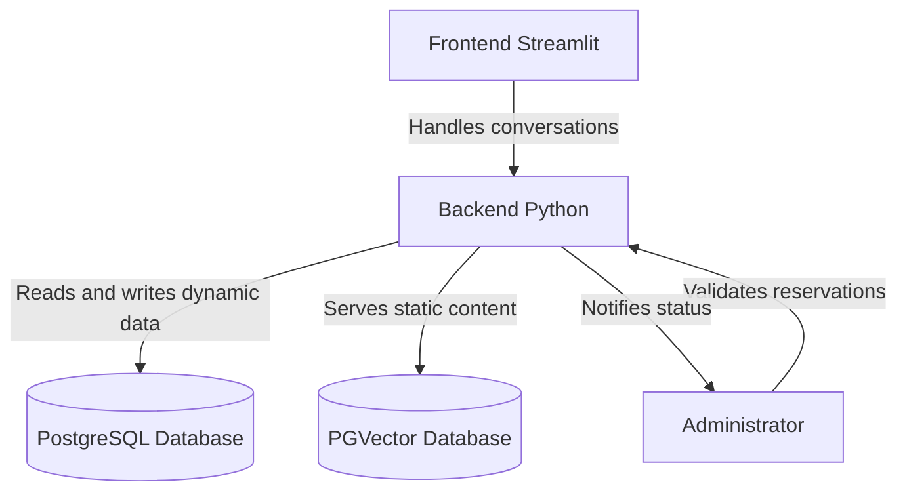
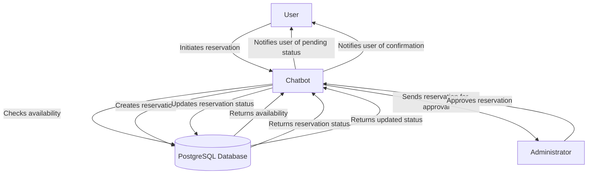

# Parking Reservation Chatbot

This project is a parking reservation chatbot built using Python and the Streamlit framework. The chatbot allows users to reserve parking spaces, check availability, and manage their reservations through a conversational interface.

There is a client and an administrator interface. The client interface allows users to interact with the chatbot to make reservations, while the administrator interface provides tools for managing parking spaces and reservations.

## Features

- **User Authentication**: Users can create accounts and log in to manage their reservations.
- **Parking Space Management**: Administrators can add, edit, and remove parking spaces.
- **Reservation System**: Users can reserve parking spaces for specific dates and times.
- **Availability Check**: Users can check the availability of parking spaces before making a reservation.
- **User-Friendly Interface**: The chatbot provides a conversational interface for easy interaction.
- **Database Integration**: The chatbot interacts with a PostgreSQL database for dynamic data and a PGVector database for static data.
- **Human validation**: The chatbot includes a human validation step by the administrator (human in the loop) to ensure that reservations are accurate and to handle any special requests or issues that may arise.
Until human approved the reservation is in pending status. Once approved, the reservation is confirmed and the user is notified.

## Data model/Databases

For dynamic data space availabiltiy, working hours , prices, user data stored in PotgreSQL database. The chatbot interacts with the database to retrieve and update information as needed.

For static data like general information, parking details location use PGVector database. This allows for efficient retrieval of static information without the need for frequent updates. This separation of dynamic and static data helps optimize performance and ensures that the chatbot can provide accurate and up-to-date information to users and provides the right context for the chatbot to respond to user queries effectively.

## Architecture

The architecture of the parking reservation chatbot consists of the following components:

- **Frontend**: Built using Streamlit, the frontend provides a user-friendly interface for both clients and administrators to interact with the chatbot. Desined to be replacabe with a React or Vue frontend in the future if needed.
- **Backend**: The backend is responsible for handling business logic, processing user requests, and interacting with the databases. It is built using Python and includes the chatbot logic and database interactions. It is using Pydantic AI mounted to FastAPI and streaming repsonses.
- **Databases**: The PostgreSQL database is used for dynamic data storage, while the PGVector database is used for static data storage.

## Archihetture Pattern

Hexagonal architecture (also known as ports and adapters) is used in this project to ensure a clear separation of concerns and to allow for flexibility in the implementation of different components. The chatbot logic is decoupled from the database interactions, allowing for easier maintenance and scalability. The frontend interacts with the backend through defined interfaces (ports), and the backend interacts with the databases through adapters, allowing for easy replacement or modification of components without affecting the overall system.

## Architecture Diagram

Mermaid diagram illustrating the architecture of the parking reservation chatbot:



## Flow diagram illustrating the flow of the parking reservation process



## Getting Started

### Prerequisites

- **Docker** or **Podman** with compose support
- **Ollama** (optional, for local LLM) - Install from [ollama.ai](https://ollama.ai)

### Running with Docker Compose

The easiest way to run the entire application stack locally is using Docker Compose or Podman Compose.

#### 1. Clone the repository

```bash
git clone <repository-url>
cd ai-parking-reservation
```

#### 2. Set up environment variables (optional)

The application works out of the box with default settings. If you want to customize:

```bash
cp .env.example .env
# Edit .env with your preferred settings
```

#### 3. Start the services

**Using Docker Compose:**
```bash
docker-compose up -d
```

**Using Podman Compose:**
```bash
podman-compose up -d
```

This will start three services:
- **PostgreSQL + pgvector** (port 5432) - Database for dynamic and static data
- **FastAPI REST API** (port 8000) - Backend API
- **Streamlit UI** (port 8501) - Web interface

#### 4. Set up Ollama (for local LLM)

If using local mode (default), you need Ollama running on your host machine:

```bash
# Install Ollama from https://ollama.ai, then pull the model
ollama pull llama3.2

# Or use a different model (update OLLAMA_MODEL in docker-compose.yml)
ollama pull gpt-oss:20b
```

**Note:** The containers use `host.containers.internal` to access Ollama on your host machine.

#### 5. Troubleshooting: Container-to-Host Ollama Connectivity

If you encounter connection errors when containers try to reach Ollama on the host, follow these steps:

**Symptom:** Logs show `httpx.ConnectError: All connection attempts failed` or `Connection refused` when trying to connect to `http://host.containers.internal:11434`

**Root Cause:** By default, Ollama only listens on `127.0.0.1:11434` (localhost), which is not accessible from containers even with the `host.containers.internal` hostname mapping.

**Solution:**

1. **Edit the Ollama service override configuration:**
   ```bash
   sudo nano /etc/systemd/system/ollama.service.d/override.conf
   ```

2. **Add the OLLAMA_HOST environment variable:**
   
   Add this line to make Ollama listen on all network interfaces:
   ```ini
   Environment="OLLAMA_HOST=0.0.0.0:11434"
   ```
   
   The final file should look like:
   ```ini
   [Service]
   Environment="OLLAMA_CONTEXT_LENGTH=4096"
   Environment="OLLAMA_HOST=0.0.0.0:11434"
   ```

3. **Reload systemd and restart Ollama:**
   ```bash
   sudo systemctl daemon-reload
   sudo systemctl restart ollama
   ```

4. **Verify Ollama is listening on all interfaces:**
   ```bash
   ss -tlnp | grep 11434
   ```
   
   You should see:
   ```
   LISTEN 0  4096  *:11434  *:*
   ```
   
   (Notice `*:11434` instead of `127.0.0.1:11434`)

5. **Test connectivity from a container:**
   ```bash
   podman exec parking-reservation-api python -c "import urllib.request; print(urllib.request.urlopen('http://host.containers.internal:11434/v1/models').status)"
   ```
   
   Expected output: `200`

**Security Note:** Making Ollama listen on `0.0.0.0` means it will accept connections from any network interface. If you're on a trusted network or using a firewall, this is generally safe. For production deployments, consider using more restrictive network configurations.

#### 6. Access the application

- **Client Interface**: http://localhost:8501
- **Admin Interface**: http://localhost:8501 (select Admin from sidebar)
- **REST API**: http://localhost:8000
- **API Documentation**: http://localhost:8000/docs

#### 7. Managing the services

```bash
# View logs
docker-compose logs -f
# or
podman-compose logs -f

# Stop services
docker-compose down
# or
podman-compose down

# Stop and remove data
docker-compose down -v  # WARNING: This deletes the database
# or
podman-compose down -v
```

### Alternative: Running Locally (Development)

For development without Docker:

#### 1. Install dependencies

```bash
# Install uv package manager
curl -LsSf https://astral.sh/uv/install.sh | sh

# Install dependencies
uv sync
```

#### 2. Start PostgreSQL

```bash
podman-compose up -d postgres
# or
docker-compose up -d postgres
```

#### 3. Set up environment

```bash
cp .env.example .env
# Edit .env:
# - Set USE_POSTGRES=true
# - Configure DATABASE_URL if needed
```

#### 4. Run the application

```bash
# Run Streamlit UI
uv run streamlit run main.py

# Or run REST API
uv run python main_api.py
```

### Configuration Options

Key environment variables (see `.env.example` for full list):

| Variable | Default | Description |
|----------|---------|-------------|
| `LOCAL_MODE` | `true` | Use Ollama (true) or OpenRouter (false) |
| `OLLAMA_MODEL` | `llama3.2` | Ollama model name |
| `OLLAMA_BASE_URL` | `http://localhost:11434/v1` | Ollama API endpoint |
| `DATABASE_URL` | `postgresql://...` | PostgreSQL connection string |
| `USE_POSTGRES` | `false` | Use PostgreSQL (true) or in-memory (false) |
| `ADMIN_APPROVAL_REQUIRED` | `true` | Enable human-in-the-loop approval |
| `MAX_RESERVATION_DAYS` | `30` | Maximum days in advance for reservations |

## Reservation Process Flow

Logical flow showing how administrator approval influences reservation status:


