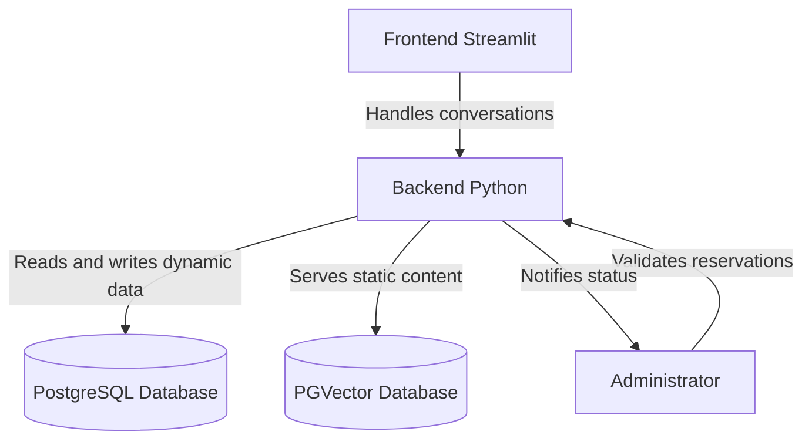
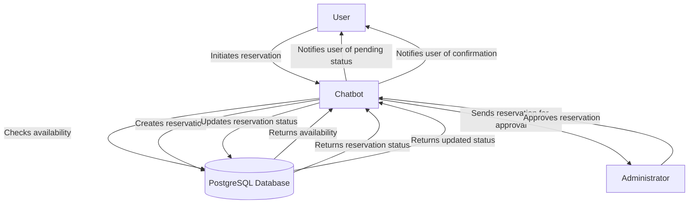
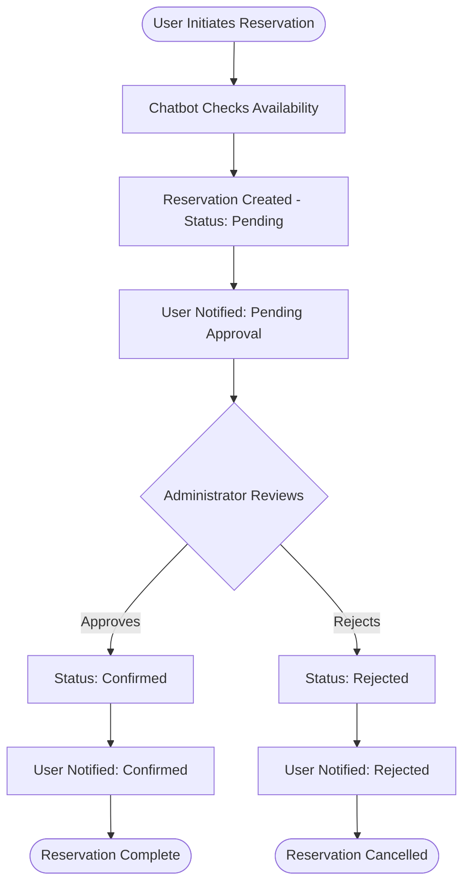

# Parking Reservation Chatbot

This project is a parking reservation chatbot built using Python and the Streamlit framework. The chatbot allows users to reserve parking spaces, check availability, and manage their reservations through a conversational interface.

There is a client and an administrator interface. The client interface allows users to interact with the chatbot to make reservations, while the administrator interface provides tools for managing parking spaces and reservations.

## Features

- **User Authentication**: Users can create accounts and log in to manage their reservations.
- **Parking Space Management**: Administrators can add, edit, and remove parking spaces.
- **Reservation System**: Users can reserve parking spaces for specific dates and times.
- **Availability Check**: Users can check the availability of parking spaces before making a reservation.
- **User-Friendly Interface**: The chatbot provides a conversational interface for easy interaction.
- **Database Integration**: The chatbot interacts with a PostgreSQL database for dynamic data and a PGVector database for static data.
- **Human validation**: The chatbot includes a human validation step by the administrator (human in the loop) to ensure that reservations are accurate and to handle any special requests or issues that may arise.
Until human approved the reservation is in pending status. Once approved, the reservation is confirmed and the user is notified.

## Data model/Databases

For dynamic data space availabiltiy, working hours , prices, user data stored in PotgreSQL database. The chatbot interacts with the database to retrieve and update information as needed.

For static data like general information, parking details location use PGVector database. This allows for efficient retrieval of static information without the need for frequent updates. This separation of dynamic and static data helps optimize performance and ensures that the chatbot can provide accurate and up-to-date information to users and provides the right context for the chatbot to respond to user queries effectively.

## Architecture

The architecture of the parking reservation chatbot consists of the following components:

- **Frontend**: Built using Streamlit, the frontend provides a user-friendly interface for both clients and administrators to interact with the chatbot.
- **Backend**: The backend is responsible for handling business logic, processing user requests, and interacting with the databases. It is built using Python and includes the chatbot logic and database interactions.
- **Databases**: The PostgreSQL database is used for dynamic data storage, while the PGVector database is used for static data storage.

## Archihetture Pattern

Hexagonal architecture (also known as ports and adapters) is used in this project to ensure a clear separation of concerns and to allow for flexibility in the implementation of different components. The chatbot logic is decoupled from the database interactions, allowing for easier maintenance and scalability. The frontend interacts with the backend through defined interfaces (ports), and the backend interacts with the databases through adapters, allowing for easy replacement or modification of components without affecting the overall system.

## Architecture Diagram

Mermaid diagram illustrating the architecture of the parking reservation chatbot:

## Flow diagram illustrating the flow of the parking reservation process

## Reservation Process Flow

Logical flow showing how administrator approval influences reservation status:

